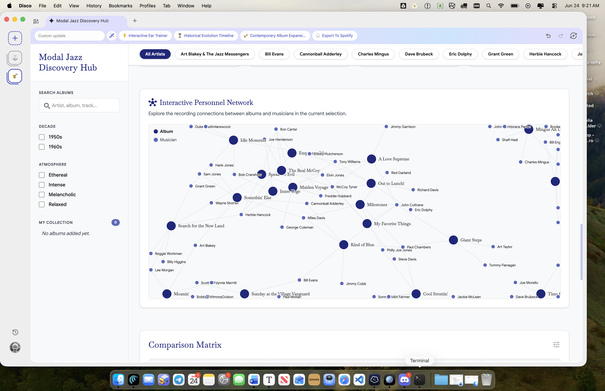
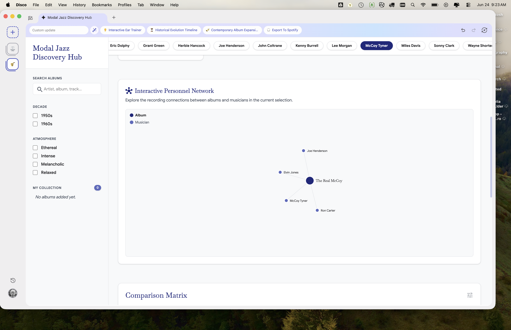
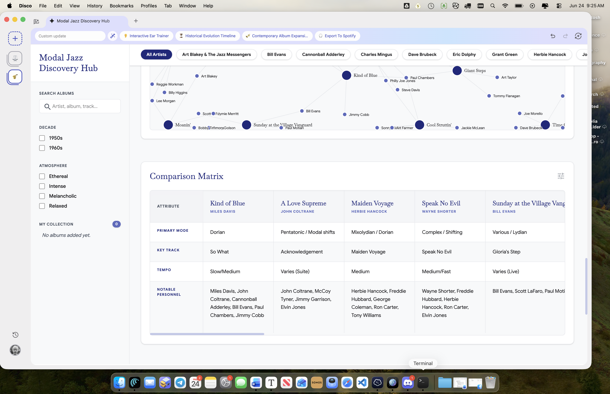
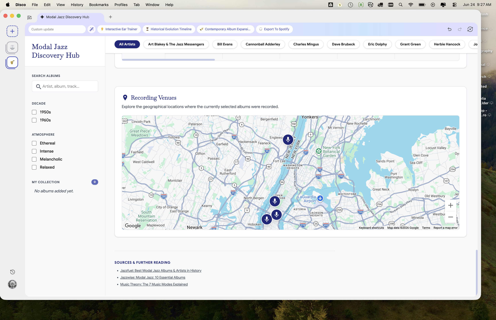
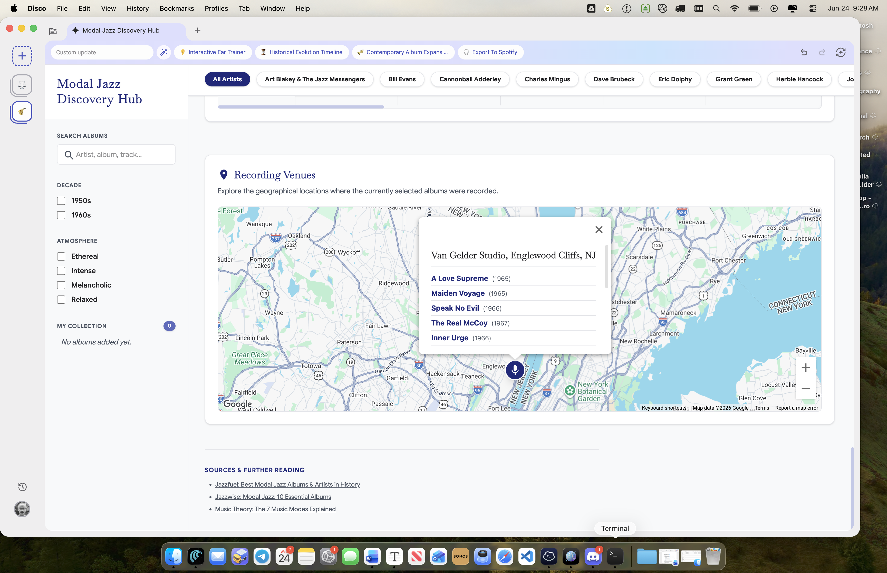
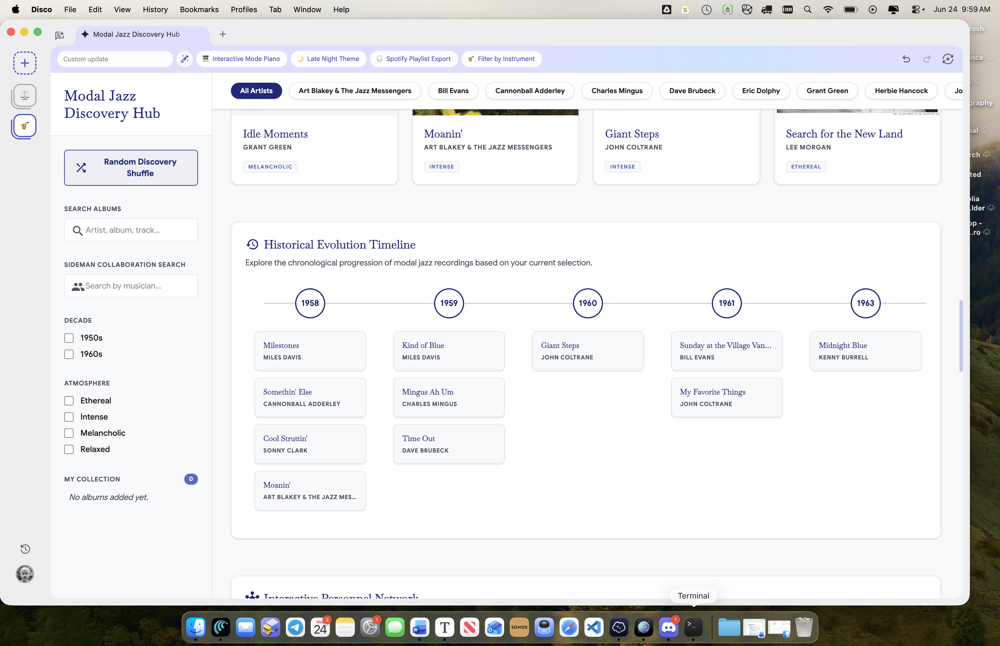
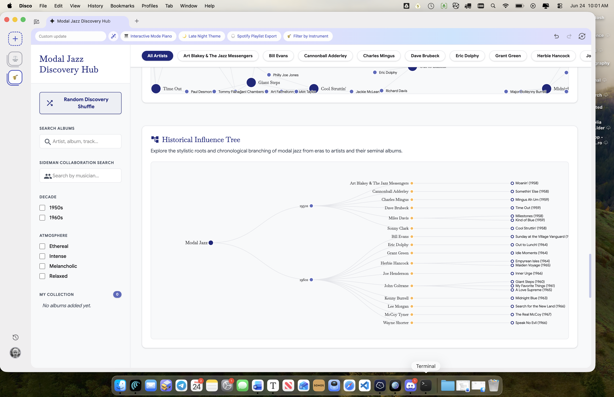
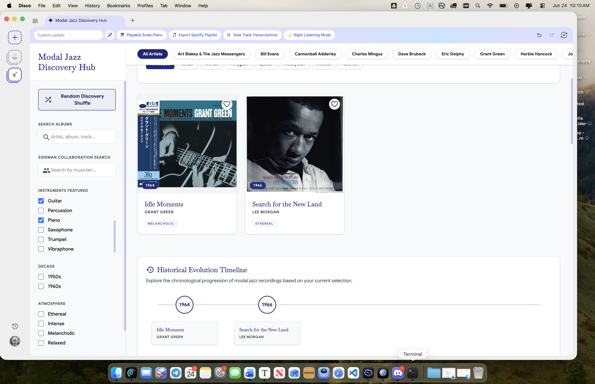
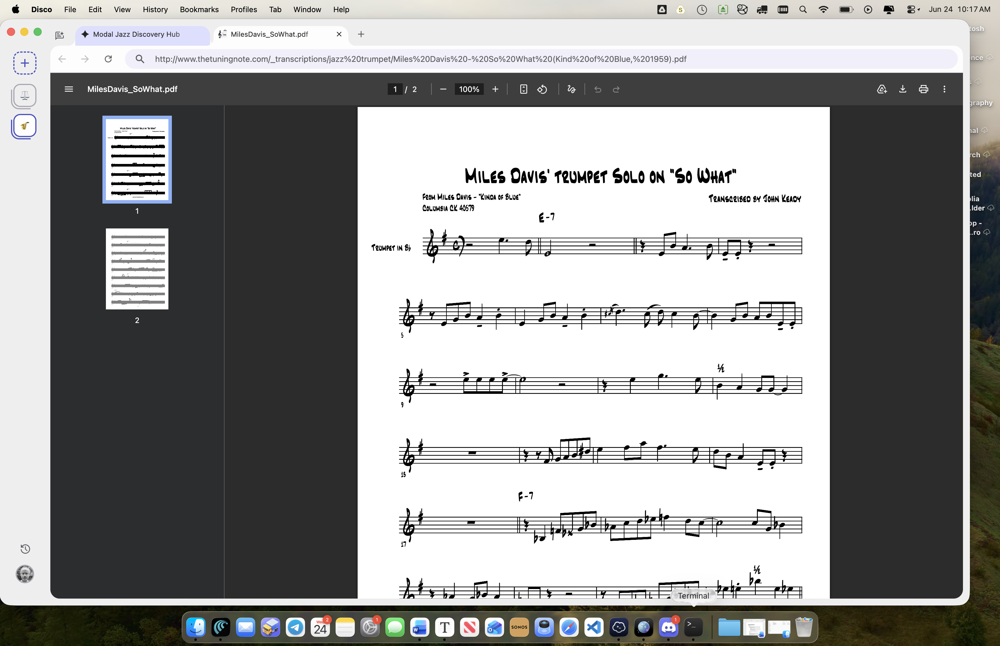

# Disco — UI/UX Reference Notes

Source: an AI-generated interactive web app ("Modal Jazz Discovery Hub"), built by prompting
a generative web-app tool to display ~20 "best" modal jazz albums. Captured here as a
**visual idea library** for the McCoy Tyner front-end — visuals only, no animations.

Each entry below pairs a screenshot with observations:
- **Steal** — what works, worth borrowing
- **Change** — what doesn't work / would do differently
- **Maps to** — how this element relates to our jazz-canon schema

---

## Synthesis — read this first (build-ready takeaways)

Captured 2026-06-24. 15 screenshots, 13 entries (#01–#15). The app is a generative web-app
demo; we mined it as a **visual idea library**, not a spec.

**The recurring theme:** *Disco shows the shape; our data fills it with substance.* Almost
every view Disco offers at album level, our **track-level personnel** (with epistemic labels)
can render deeper — finer, sourced, and provenance-aware. Disco is a generous mood board for
exactly the app we're building.

**The app's spine (a coherent flow worth adopting):**
`Grid → Album Deep Dive → Personnel Network → Comparison → Venue map → Timeline → Influence Tree`
— all powered by one shared personnel/album dataset, with filters (artist · decade · mode ·
instrument · atmosphere) cutting across.

**Signature features, ranked for our project:**
1. **Personnel Network** (#05–#06) ⭐ — force-directed musician↔album graph. Our hero
   candidate. Key interaction lesson: **scope to a selection** (artist/album) to stay legible
   — start focused, expand outward. We can add edge-weight (shared sessions), instrument
   color, track-level mode, and provenance (dashed = inference).
2. **Album Deep Dive** (#03–#04) — slide-in detail beside a persistent grid; hosts stacked
   optional sections (personnel → venue → transcriptions). Our richest screen: full tracklist
   + per-track personnel.
3. **Comparison Matrix** (#07) — transposed attribute table. Hook: **highlight shared
   personnel** across compared albums (overlap discovery Disco only hints at).
4. **Historical Evolution Timeline** (#11) — year-bucketed canon view; surfaced **Sideman
   Search** + **Filter by Instrument** as first-class axes our schema powers deeply.
5. **Venue map** (#08–#09) — fresh "place" lens; pin → studio → album set (Van Gelder as hub).
6. **Influence Tree** (#12) — lineage dendrogram.
7. **Track Transcriptions** (#14–#15) — out-of-scope "learn the music" links; lowest priority.

**The single most important principle (epistemic):**
**Network = facts, Influence Tree = narrative.** The personnel network is source-grounded
(who actually played); the influence tree is editorial interpretation. Keeping these visually
and labelled-distinct — and never letting tidy presentation launder opinion into fact — is the
direct UI expression of our direct/inference/uncertain discipline. Same applies to mood/
atmosphere tags and "primary mode" (editorial) vs. personnel/venue/date (sourced).

**Scope guardrails:** the Contemporary Explorer catalog (#10), Upcoming Concert Finder, and
transcriptions are out of bounds (post-bebop→pre-Fusion, discovery-focused). Take the
*patterns*, not the catalog — Disco's design system is reassuringly dataset-agnostic.

**Still unseen / future captures:** deeper states of the Timeline and Influence Tree once
John builds them out in the app; hover/animation states (static only here).

---

## 01 — Main grid + Interactive Mode Explorer

**Layout:** left filter sidebar · top artist-filter row · main area = "Interactive Mode
Explorer" panel sitting above a responsive album-card grid.

- **Left sidebar:** Search Albums · Decade (1950s / 1960s checkboxes) · Atmosphere
  (Ethereal / Intense / Melancholic / Relaxed) · My Collection ("No albums added yet").
- **Top nav tabs:** Interactive Era Timeline · Historical Selection Timeline ·
  Contemporary Album Explorer · Export to Spotify.
- **Artist filter row:** All Artists, Art Blakey, Bill Evans, Cannonball Adderley,
  Charles Mingus, Dave Brubeck, Eric Dolphy, Grant Green, Herbie Hancock… (scrollable).
- **Mode Explorer:** chips for the seven church modes — All Modes, Ionian, Dorian,
  Phrygian, Lydian, Mixolydian, Aeolian, Locrian. Copy: "Select a mode to see tonal
  structure and filter the collection by albums that prominently feature it."
- **Album card:** cover art with year badge overlaid bottom-left (1959, 1965…),
  serif title, small-caps gray artist, a mood tag, and a heart icon (add to collection).

- **Steal:**
  - The **album card** is clean and reusable: art + year-on-art + title + artist + one
    tag. Good template for our album records.
  - **Multi-axis filtering** (artist · decade · atmosphere · mode) all visible at once —
    a strong model for exploring a ~100-album canon without a search-first dead end.
  - Year badge burned onto the cover art is a tidy space-saver.
- **Change:**
  - Three competing filter zones (left sidebar, top artist row, mode chips) is a lot of
    chrome. We'd want to consolidate or progressively disclose.
  - "Atmosphere"/mood tags are editorial guesses — fine for vibe, but must stay visually
    distinct from source-grounded facts (per our epistemic-label rule).
- **Maps to:**
  - Artist filter → **personnel / musician** dimension (our strength — we have track-level
    personnel, so this could go far deeper than Disco's album-level artist tag).
  - Decade filter → album **year**.
  - Album card art/title/artist/year → core **album** record fields.
  - Mode Explorer → *not in our schema* — a derived/editorial tagging axis. Intriguing,
    but would need a sourced or explicitly-subjective "mode" field per album. Flag as a
    possible future enrichment, clearly labeled as inference.
  - My Collection / heart → user-favorites feature (personal single-user app — plausible).

---

## 02 — Grid, default state (Mode Explorer collapsed)

Same album grid as 01 but with the Mode Explorer panel gone — the default browse view.
Adds detail rather than a new feature:

- Confirms a **4-column responsive grid**; two rows visible (8 cards) without scrolling.
- Full **card anatomy** reads clearly: cover art (year badge bottom-left on the art) →
  serif title → small-caps artist → single mood tag beneath. Consistent, scannable rhythm.
- Visible set: Kind of Blue, A Love Supreme, Maiden Voyage, Speak No Evil / Sunday at the
  Village Vanguard, The Real McCoy, My Favorite Things, Milestones.

- **Steal:** the uncluttered default — grid leads, advanced filters (modes) are opt-in via
  the explorer. Good progressive-disclosure answer to the "too much chrome" worry from 01.
- **Change:** nothing new beyond 01's notes.
- **Maps to:** same as 01 (album card → album record). This is the view our front-end's
  default landing grid would most resemble.

---

## 03 — Album Deep Dive panel (card clicked)

Clicking an album opens a **right-hand slide-in "Album Deep Dive" panel** — the grid stays
visible on the left (no full-page navigation). This is the album-detail pattern.

Panel contents (example: Kind of Blue):
- Large cover art · title (serif) · artist · year (1959) · mood tag (Ethereal).
- Prominent **"▶ Play Album"** CTA (purple pill).
- **Synopsis** — editorial prose: "The blueprint of modal jazz. A masterful study in space
  and mood, recorded with a legendary sextet. It broke away from dense chord progressions
  into relaxed, scalar improvisation."
- Two metadata tiles: **Primary Mode** (Dorian) · **Key Track** (So What).

- **Steal:**
  - **Slide-in detail beside a persistent grid** — lets you browse-and-inspect without
    losing your place. Strong fit for exploring a canon.
  - The compact metadata-tile row (mode · key track) is a clean way to surface 2–3 facts.
  - A single clear primary action (Play Album).
- **Change:**
  - Disco's detail is thin — one synopsis, one "key track." **This is exactly where our
    app should be far deeper:** full tracklist with **track-level personnel**, our core asset.
  - "Primary Mode" again editorial — keep visually separated from sourced facts.
- **Maps to:**
  - **Album detail view** → our richest screen. Replace "Key Track" with the full
    tracklist; under each track, the personnel records (with direct/inference/uncertain
    labels). This panel is the natural host for that depth.
  - Synopsis → an editorial `description` field (clearly non-source-grounded).
  - "Play Album" → our hook into **Apple Music** (the project's integration) — link out
    per album / per track.
  - Key Track → for us, every track is first-class; "key track" could be an optional
    editorial highlight flag.

---

## 04 — Album Deep Dive, scrolled (Personnel + Venue)

Lower half of the same panel. Adds two fields not visible at the top:
- **Notable Personnel:** Miles Davis, John Coltrane, Cannonball Adderley, Bill Evans,
  Paul Chambers, Jimmy Cobb (flat comma list — no instruments, no per-track attribution).
- **Recording Venue:** Columbia 30th Street Studio, NYC.

So the full Deep Dive stack is: Play Album → Synopsis → Primary Mode · Key Track →
**Notable Personnel** → **Recording Venue**.

- **Steal:** confirms personnel + venue belong in the detail panel; the label-over-value
  tile pattern scales to these too.
- **Change:** Disco's personnel is a **flat album-level name list** — no instruments, no
  track mapping, no provenance.
- **Maps to:** direct hit on our core asset. Our equivalent:
  - **Personnel** → structured records (musician · instrument · per-track) with
    direct/inference/uncertain labels — not a flat string.
  - **Recording Venue** → we likely have session/venue data too; same tile works.
  - This confirms the Deep Dive is the right container for our richer personnel depth —
    Disco shows the *shape*, we fill it with *substance*.

---

## 05 — Interactive Personnel Network  ⭐ signature feature

**Force-directed node-link graph.** Header: "Interactive Personnel Network — Explore the
recording connections between albums and musicians in the current selection."

- **Two node types:** large blue nodes = **albums** (The Real McCoy, Maiden Voyage, Out to
  Lunch, A Love Supreme, Milestones, My Favorite Things, Kind of Blue, Sunday at the Village
  Vanguard, Search for the New Land…); smaller nodes = **musicians** (John Coltrane, Jimmy
  Garrison, McCoy Tyner, Tony Williams, Herbie Hancock, George Coleman, Paul Chambers,
  Charles Mingus, Wynton Kelly…).
- **Edges = "played on"** connections. Shared sidemen become visible hubs linking albums.
- Graph is scoped to the **current selection** (responds to the filters/artist row).
- A **Comparison Matrix** section begins just below (next capture candidate).

- **Steal — strongly:** this is the most compelling idea in the whole app for *our*
  purposes. A canon isn't just a list; it's a **web of who-played-with-whom**, and the
  modal/hard-bop scene is densely interconnected (Tyner↔Coltrane↔Garrison↔Jones, the
  Miles alumni tree, etc.). A graph makes that legible at a glance and invites discovery
  ("who connects these two albums?").
- **Change / go deeper:** Disco's edges are **album↔musician at album level only**. Ours
  can be richer:
  - Edge weight = number of shared tracks/sessions (thicker = tighter collaboration).
  - **Instrument-aware** edges/nodes (color by instrument; a player who switches instruments
    across dates shows up).
  - Optional **track-level** mode (musician↔track) for deep dives.
  - Encode provenance: dim/dash edges that are inference vs. direct (our epistemic labels
    carry straight into the visual).
- **Maps to:** our personnel data **is** a bipartite graph already (musician — album, and
  one level down, musician — track). This view is essentially a direct render of our core
  schema. **Top candidate for the app's signature/hero feature** — the thing Disco only
  gestures at and our data can fully deliver.

---

## 06 — Personnel Network, filtered to one artist (McCoy Tyner)

Same network with **McCoy Tyner** selected in the artist row (highlighted purple). The dense
graph collapses to a clean **star**:
- Center: album node **The Real McCoy**.
- Spokes: **Joe Henderson, Elvin Jones, McCoy Tyner, Ron Carter** — the real 1967 quartet.
- Legend: blue = Album, lighter = Musician.

- **Steal — key interaction lesson:** a full personnel graph is a hairball; **scoping to a
  selection (artist/album) is what makes it legible.** The filtered star is far more
  readable and is the right default — start focused, let the user expand outward. Solves
  the "too dense to use" risk of the hero graph in 05.
- **Change:** even this minimal view, in our app, would carry instruments per spoke
  (Henderson=tenor, Jones=drums, Carter=bass, Tyner=piano) and link each musician to their
  *other* albums for one-hop exploration.
- **Maps to:** the focused subgraph = "this album's session" or "this musician's
  collaborators." Natural entry point: click a musician in the Deep Dive (03/04) →
  open this scoped network around them. Ties the detail panel and the graph together.

---

## 07 — Comparison Matrix

A **side-by-side attribute table**: columns = albums (Kind of Blue, A Love Supreme, Maiden
Voyage, Speak No Evil, Sunday at the Village Vanguard…), rows = attributes:
- **Primary Mode** (Dorian / "Pentatonic, Modal shifts" / Dorian / "Conger Shifting" /
  "Various, Lydian")
- **Key Track** (So What / Acknowledgement / Maiden Voyage / Speak No Evil / Gloria's Step)
- **Tempo** (Slow/Medium / Varies (Suite) / Medium / Medium/Fast / Varies (Live))
- **Notable Personnel** (full session lists per album)

Header has a gear/settings affordance (likely choose-your-columns / attributes).

- **Steal:** great for a canon — lets you put a handful of albums next to each other and
  read differences down a column. The transposed layout (attributes as rows, albums as
  columns) is the right call for comparing a small set in depth.
- **Change:** Disco's attributes are mostly editorial (mode, tempo, key track). Ours can be
  a mix, clearly separated: **source-grounded** rows (personnel, instrumentation, recording
  date, venue, label, track count) vs. **editorial** rows (mood, "key track"), with the
  epistemic label visible.
- **Maps to:**
  - A **compare view** seeded from selection / "add to compare" on cards or the Deep Dive.
  - The **Notable Personnel** row is the standout hook: with our data we can **highlight
    shared musicians across the compared albums** (e.g. Elvin Jones in both A Love Supreme
    and Speak No Evil) — turning a static table into overlap discovery. Disco lists names
    but doesn't connect them; our graph data does. Ties back to the Personnel Network (05/06).

---

## 08 — Recording Venues map + Sources

Two things on one screen.

**Recording Venues map** — "Explore the geographical locations where the currently selected
albums were recorded." A live Google-Maps embed with numbered/clustered pins, centered on
the **NYC/NJ metro** (Manhattan, Newark, Westchester, Long Island Sound). Fitting — the
modal/hard-bop catalog clusters around a few rooms (Columbia 30th Street Studio in
Manhattan, Van Gelder in Englewood Cliffs NJ, etc.).

**Sources & Further Reading** — a short list of external article links (best-modal-jazz
lists, a modes explainer). Editorial bibliography, not per-fact citation.

- **Steal:**
  - A **place dimension** is a genuinely fresh lens — most of this music was made in a
    surprisingly small geography; a map makes that vivid and is a nice change of pace from
    grids/graphs.
  - Having a visible **Sources** section at all signals credibility.
- **Change:**
  - Disco's pins are album-level and approximate. With our **venue/session data** we can
    plot actual studios and group albums by room ("everything cut at Van Gelder").
  - Sources here are generic outbound links. **Ours should be per-claim provenance** — the
    source behind each personnel fact, with the direct/inference/uncertain label. Much
    stronger, and core to the project's epistemic stance.
- **Maps to:**
  - **Recording Venue** field (seen in 04) → geocode → this map. Could also drive a
    "browse by studio" facet.
  - Sources → our provenance model, but elevated from a bibliography to **citations
    attached to individual records**.

---

## 09 — Venue map, pin clicked (album-by-studio grouping)

Clicking a pin opens an info popup tied to one studio — here **Van Gelder Studio, Englewood
Cliffs, NJ** — listing every selected album recorded there (each with year, looks clickable):
A Love Supreme (1965), Maiden Voyage (1965), Speak No Evil (1966), The Real McCoy (1967),
Inner Urge.

Confirms the map isn't decorative — it's a **"browse by studio" facet**. One pin = one room =
the set of canon albums cut there. (Van Gelder is the obvious supernode for this catalog.)

- **Steal:** the click-pin → album-list interaction is the payoff that makes the map worth
  building; it turns geography into a real navigation path.
- **Change:** album entries should link back to the Deep Dive (03/04) — pin → studio → album
  → personnel. With our data the popup could also show *who* recorded there most (Van Gelder
  + Coltrane/Tyner/Elvin clustering), bridging venue and personnel.
- **Maps to:** Recording Venue field → geocoded pin → album set. Strengthens the case that
  **venue is a first-class browse axis** alongside artist, decade, and the personnel graph.
  Studios like Van Gelder become natural "hubs" the same way recurring sidemen do.

---

## 10 — Contemporary Album Explorer (top-nav view)

A **parallel mode** to the main hub: same UI shell, a *contemporary* catalog. Title becomes
"Contemporary Album Explorer."

- **Catalog:** Devotion / Muriel Grossmann (2022), The Epic / Kamasi Washington (2015),
  Connection / Empirical, We Like It Here / Snarky Puppy (2014), Promises / Floating Points
  & Pharoah Sanders (2021), Source / Nubya Garcia (2020), Black Focus / Yussef Kamaal (2016)…
- **Decade filter shifts** to 2010s / 2020s; **Atmosphere taxonomy expands** (Energetic,
  Ethereal, Groove, Intellectual, Intense, Spiritual).
- New left control: **"Random Discovery Shuffle"** (serendipity button).
- Different top-nav tabs here: Bark/Dark Synth Mode, Live Audio Visualizer, **Historical
  Influence Tree**, Upcoming Concert Finder.

- **Steal:**
  - Proves the **design system is dataset-agnostic** — same cards/filters/shell, new corpus.
    Reassuring for our build: one component set serves the whole canon.
  - **Random Discovery Shuffle** — cheap, delightful serendipity entry for a curated set.
  - **Historical Influence Tree** (tab) — another graph/lineage idea, and *directly* relevant
    to a canon: who-influenced-whom. Worth capturing if you build it out.
- **Change / scope note:** the **content is out of our scope** (post-bebop→pre-Fusion only;
  this is 2010s–20s). Likewise "Upcoming Concert Finder" is moot for a largely historical,
  deceased-artist canon. Take the *patterns*, not the catalog.
- **Maps to:**
  - Atmosphere/decade facets → same as our filters, just different values.
  - Influence Tree → a potential **lineage view** layered on our personnel graph (mentor →
    sideman → bandleader chains), clearly labeled where it's editorial vs. sourced.
  - Random Shuffle → a "surprise me" affordance over the canon.

---

## 11 — Historical Evolution Timeline

**Horizontal chronological timeline.** "Explore the chronological progression of modal jazz
recordings based on your current selection." A year axis with circular nodes; under each
year, the albums from that year stacked as small cards:
- **1958:** Milestones (Miles Davis), Somethin' Else (Cannonball), Cool Struttin' (Sonny
  Clark), Moanin' (Art Blakey)
- **1959:** Kind of Blue, Mingus Ah Um, Time Out
- **1960:** Giant Steps
- **1961:** Sunday at the Village Vanguard, My Favorite Things
- **1963:** Midnight Blue (Kenny Burrell)

**Two bonus features spotted in this view (map directly to our data):**
- **Sideman Collaboration Search** (left sidebar) — "search by musician." Personnel-first
  entry point.
- **Filter by Instrument** (top-nav tab) — instrument-level filtering.

(Page also stacks the Personnel Network again below — these views are modular, composed on
one scroll.)

- **Steal:**
  - The **year-bucketed timeline is a natural canon view** — it makes the explosion of
    1958–61 legible at a glance (how many landmark dates cluster in a few years).
  - **Sideman Collaboration Search** and **Filter by Instrument** are exactly the axes our
    track-level personnel unlocks — Disco exposes them; our data can actually power them
    deeply (search a bassist, filter to all the tenor-led dates, etc.).
- **Change:** Disco buckets by year only. We could add **session-date** granularity (month/
  day), and let the timeline interact with the graph (scrub a year → network repopulates).
- **Maps to:**
  - Album **year/date** → timeline axis (we likely have finer recording dates than release
    year — a more precise timeline than Disco's).
  - Sideman search → our **musician** index; Filter by Instrument → our **instrument** field.
    These two confirm personnel + instrument as first-class browse axes, not just detail
    fields. Strongest alignment yet between Disco's UI and our schema's depth.

---

## 12 — Historical Influence Tree

A **left-to-right dendrogram** (hierarchical tree). "Explore the stylistic roots and
chronological branching of modal jazz from era to artists and their seminal albums."

- **Root:** Modal Jazz → a couple of **era/branch** nodes → **artists** (Art Blakey,
  Cannonball, Mingus, Brubeck, Dolphy, Grant Green, Sonny Clark, Bill Evans, Hancock,
  Kenny Burrell, Lee Morgan, McCoy Tyner, Miles Davis…) → **seminal albums** with years
  (Moanin' '58, Kind of Blue '59, Sunday at the Village Vanguard '61, Out to Lunch '64,
  Maiden Voyage '65, The Real McCoy '67, Speak No Evil '66, Milestones '58…).

**Important distinction from the Personnel Network (05/06):** that graph is *factual* —
who-actually-played-on-what. This tree is *interpretive* — a claim about stylistic lineage
and influence. Two different epistemic categories, two different visual grammars (force graph
vs. hierarchy).

- **Steal:** a clean **lineage/genealogy view** is a compelling third graph mode and a great
  "tell the story of the music" entry. The dendrogram is the right shape for hierarchy
  (root → era → artist → album).
- **Change / critical for us:** influence is **editorial interpretation**, not source-grounded
  fact. Under our epistemic rules this whole view must be **clearly labeled as inference/
  editorial** and kept visually distinct from the personnel network's sourced facts. Risk to
  flag: a tidy tree *looks* authoritative; we must not let presentation launder opinion into
  fact.
- **Maps to:**
  - Could be **derived** partly from our data (chronology, shared-personnel proximity) plus
    an explicit editorial layer for the "influence" edges — each carrying a provenance note.
  - Complements, doesn't replace, the personnel graph: **Network = facts, Tree = narrative.**
    Offering both (clearly differentiated) is a strong, honest design — and a natural
    expression of the project's direct/inference/uncertain discipline.

---

## 13 — Instruments Featured filter (faceted)

Confirms the "Filter by Instrument" axis is a **sidebar checkbox facet**: Guitar, Percussion,
Piano, Saxophone, Trumpet, Vibraphone. With **Guitar + Piano** checked, the grid narrows to
Idle Moments (Grant Green, 1964) and Search for the New Land (Lee Morgan, 1964); the timeline
below re-buckets to match. (Also visible up top: a **"View Track Transcriptions"** tab —
next to explore.)

- **Steal:** instrument facet is a clean, expected filter for a jazz library.
- **Change:** Disco's instrument list is coarse (6 buckets, album-level). Our **track-level
  personnel** ties an instrument to a *specific musician on a specific track*, so we can go
  far finer (e.g. "soprano sax," "albums where Tyner plays anything but piano").
- **Maps to:** our **instrument** field → this facet. Closes the loop with 11: personnel +
  instrument confirmed as first-class browse axes that our schema powers more deeply than
  Disco can.

---

## 14–15 — Track Transcriptions (panel section → external PDF)

**14:** the Album Deep Dive panel gains a **Track Transcriptions** section at the bottom — a
list of outbound links per track: solo transcriptions, sheet music (MuseScore), Learn Jazz
Standards, bass transcriptions ("So What Trumpet Solo," "So What Bass Transcription," etc.).
**15:** clicking one opens the **actual transcription PDF in a new in-app browser tab** — e.g.
"Miles Davis' Trumpet Solo on 'So What'" (Kind of Blue, Columbia CK 40579, transcribed by
John Kaddy), hand-notated, Trumpet in B♭.

(Also confirms Disco is a **browser/Chromium shell** — real tabs, URL bar; external links open
as tabs in-app.)

- **Steal:** a **"play/learn the music" layer** — per-track links to transcriptions/sheet
  music. A delightful extra for a listener who's also a player; cheap if it's just curated links.
- **Change / scope:** **out of our core scope** (we're canon + personnel discovery, not a
  practice resource). If adopted, treat as an **optional enrichment**, and mark these as
  **third-party, unverified external resources** (quality varies; not our sourced data).
- **Maps to:** an optional per-track `resources[]` / external-links field. Lowest-priority of
  everything seen — note it, don't build around it. Most valuable as evidence that the Deep
  Dive panel can host stacked optional sections (personnel → venue → transcriptions → …),
  which is the real reusable lesson.
